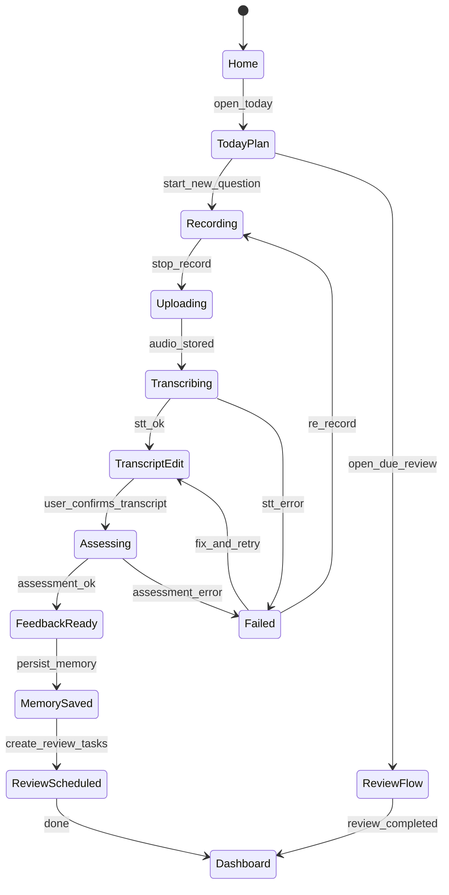
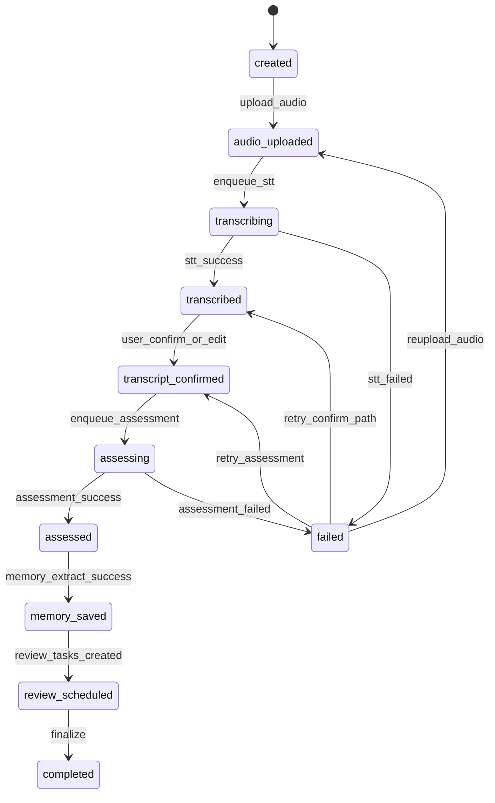
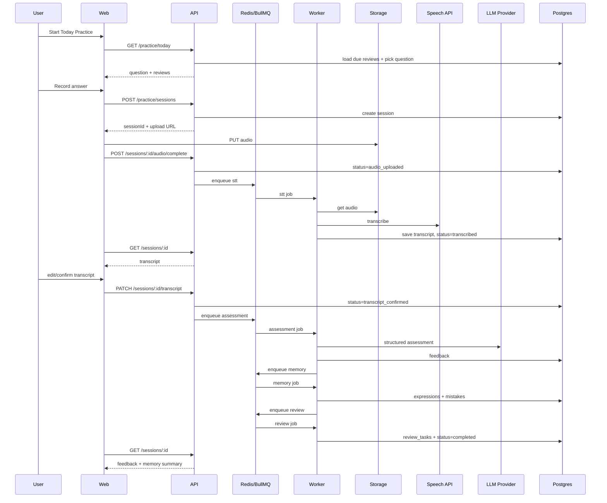
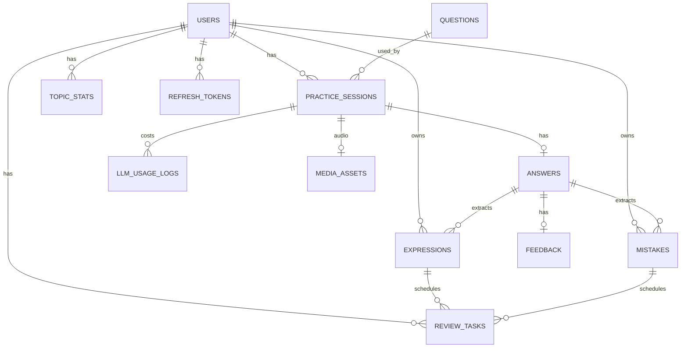

# SpeakingOS MVP v1.0 — Product & Technical Design (Unified)

> Single source of truth for product + architecture  
> Locked: Desktop Web · 1 new question/day + due reviews · Transcript confirm before assess · NestJS REST + OpenAPI

---

## Table of Contents

1. [Product Overview](#1-product-overview)
2. [MVP Goal & Scope Freeze](#2-mvp-goal--scope-freeze)
3. [Locked Product Rules](#3-locked-product-rules)
4. [Core Features](#4-core-features)
5. [User Flow & Edge Cases](#5-user-flow--edge-cases)
6. [System Architecture](#6-system-architecture)
7. [Deployment Topology](#7-deployment-topology)
8. [Monorepo & Module Structure](#8-monorepo--module-structure)
9. [Practice Session State Machine](#9-practice-session-state-machine)
10. [Sync vs Async & Queues](#10-sync-vs-async--queues)
11. [End-to-End Sequence](#11-end-to-end-sequence)
12. [REST API Contracts](#12-rest-api-contracts)
13. [Database Design](#13-database-design)
14. [Agent & Workflow Design](#14-agent--workflow-design)
15. [LLM Adapter & Prompts](#15-llm-adapter--prompts)
16. [Speech & Storage](#16-speech--storage)
17. [Memory & Review Algorithms](#17-memory--review-algorithms)
18. [Frontend Architecture](#18-frontend-architecture)
19. [Auth, Security & Privacy](#19-auth-security--privacy)
20. [NFR / SLO / Cost](#20-nfr--slo--cost)
21. [Observability](#21-observability)
22. [Testing & Evaluation](#22-testing--evaluation)
23. [Implementation Roadmap](#23-implementation-roadmap)
24. [Risks & Decision Log](#24-risks--decision-log)
25. [Future Roadmap](#25-future-roadmap)
26. [Product Principles](#26-product-principles)

---

## 1. Product Overview

### Product Name

SpeakingOS

### Vision

An AI speaking coach that remembers how users speak, tracks their progress, and continuously helps them improve toward IELTS Band 7.

Unlike traditional IELTS apps, SpeakingOS is not designed to answer questions—it is designed to build a long-term personalized learning loop.

### Core Value

> Learn → Practice → Feedback → Memory → Review → Improve

### Primary Persona

IELTS candidates currently around Band 5.5–6.5, targeting Band 7.0, practicing on desktop web.

---

## 2. MVP Goal & Scope Freeze

### MVP Goal

Complete one full learning cycle:

```text
User answers one IELTS Speaking question
  → AI evaluates the answer
  → AI saves learning history
  → AI generates personalized feedback
  → AI schedules future review
```

### In Scope (V1)

- IELTS Speaking Part 1 only
- Daily new question + due reviews
- Voice recording → STT → transcript confirm → assessment
- Band estimate + multi-dimension feedback
- Structured personal memory
- Spaced review tasks
- Desktop web (Chrome / Safari)
- Dashboard summary

### Out of Scope (V1)

- Listening / Writing / Reading
- IELTS Part 2 / Part 3
- Pronunciation scoring
- Mobile-first / native app
- Autonomous multi-agent debate
- Vector RAG memory
- Real-time streaming assessment UI
- Teacher dashboard

### Success Metrics

| Metric | Definition |
|---|---|
| Activation | User completes first assessed answer |
| Practice completion | Session reaches `completed` |
| D1 / D7 return | Returns next day / within 7 days |
| Review completion | Due reviews marked complete |
| Band trend | Moving average of estimated band over 14–30 days |

---

## 3. Locked Product Rules

| # | Rule |
|---|---|
| 1 | **Platform**: Desktop web first (Chrome + Safari). Mobile later. |
| 2 | **Daily loop**: Exactly **1 new Part 1 question/day** + all due review tasks. |
| 3 | **Assessment gate**: User must confirm/edit transcript before assessment. |
| 4 | **API**: NestJS REST + OpenAPI. No tRPC in V1. |
| 5 | **Memory**: Structured memory first (no vector DB in V1). |
| 6 | **Agents**: Workflow-orchestrated specialist agents, not free-form multi-agent chat. |
| 7 | **“Today”**: Computed in user `timezone` (default `Asia/Shanghai`). |
| 8 | **Re-record**: Allow replacing audio until transcript is confirmed. |

---

## 4. Core Features

### 4.1 Daily Speaking Practice

User opens Today Practice. System returns:

- 1 new Part 1 question (if not completed today)
- Due review tasks

Example question:

> Do you enjoy drinking coffee?

### 4.2 Voice Recording

```text
Record → Upload → Speech-to-Text → Transcript (editable) → Confirm
```

Speech service (V1 primary recommendation): Whisper API  
Future: OpenAI Speech, Deepgram

Constraints:

- Min 5s / Max 90s
- Max 10MB
- `audio/webm;codecs=opus` preferred, `audio/mp4` fallback

### 4.3 AI Assessment

After transcript confirmation, evaluate:

- Grammar
- Vocabulary
- Fluency
- Coherence
- Naturalness
- Pronunciation (Future)

Output:

- Estimated Band Score
- Grammar feedback
- Vocabulary suggestions
- Native version
- Band 7 version
- Expressions + mistakes for memory

Disclaimer: estimated score, not official IELTS.

### 4.4 Personal Memory

Every completed answer becomes learning data:

- Question / topic
- Transcript
- Band score
- Expressions
- Mistakes

Memory personalizes future practice and reviews.

### 4.5 Review Engine

Auto-create review tasks (1 / 3 / 7 / 14 day intervals) for:

- New expressions
- High-severity mistakes
- Optional weak-topic retry later

---

## 5. User Flow & Edge Cases

### Happy path

```text
Home
 → Today's Practice
 → Record Answer
 → Speech-to-Text
 → Edit/Confirm Transcript
 → Assessment
 → Save Memory
 → Generate Better Versions
 → Create Review Tasks
 → Dashboard Update
```

### Product state machine (UX)



### Edge cases to support

1. First-time onboarding (target band, exam date, timezone)
2. Microphone permission denied
3. Recording too short / too long
4. STT failure / low confidence
5. User edits transcript before assessment
6. Assessment timeout / partial failure
7. Reconnect + resume in-flight session
8. Review task completion UX
9. Dashboard empty states
10. Daily limit already completed

---

## 6. System Architecture

### Logical architecture

```text
┌─────────────────────────────────────────────────────────────┐
│                     Desktop Web (Next.js 15)                │
│  Home · Today Practice · Recorder · Transcript Edit         │
│  Feedback · Reviews · Dashboard                             │
└───────────────────────────┬─────────────────────────────────┘
                            │ HTTPS / REST JSON
                            ▼
┌─────────────────────────────────────────────────────────────┐
│                     API (NestJS + OpenAPI)                  │
│  Auth · Practice · Review · Memory · Dashboard              │
│  Session State Machine · Idempotency · Rate Limit           │
└───────────────┬─────────────────────────────┬───────────────┘
                │ enqueue jobs                │ read/write
                ▼                             ▼
┌───────────────────────────┐     ┌───────────────────────────┐
│   Worker (BullMQ)         │     │   PostgreSQL (Prisma)     │
│  stt / assessment         │     │  users/sessions/answers   │
│  memory / review          │     │  feedback/memory/reviews  │
└───────────┬───────────────┘     └───────────────────────────┘
            │
            ▼
┌─────────────────────────────────────────────────────────────┐
│                     Tool + AI Layer                         │
│  SpeechTool · LLM Adapter · StorageTool · Prompt Registry   │
│  Claude / GPT / Gemini / DeepSeek via provider interface    │
└─────────────────────────────────────────────────────────────┘
```

### Design principles

- **API** owns authorization, state transitions, contracts
- **Worker** owns long-running AI/IO
- **Agents** are domain services invoked by workflows
- **Web** never calls LLM/STT providers directly
- Business code never depends on a concrete LLM vendor

### Backend stack

| Layer | Choice |
|---|---|
| Language | TypeScript |
| API | NestJS + OpenAPI |
| DB | PostgreSQL |
| ORM | Prisma |
| Auth | JWT + Refresh Token |
| Validation | Zod |
| Cache / Queue | Redis + BullMQ |
| Storage | Supabase Storage / AWS S3 / MinIO local |
| Deploy | Docker (K8s future) |

### Frontend stack

| Layer | Choice |
|---|---|
| Framework | Next.js 15 |
| UI | TailwindCSS + shadcn/ui |
| State | TanStack Query |
| Forms | React Hook Form |
| Charts | Recharts |
| Audio | MediaRecorder API |

---

## 7. Deployment Topology

```text
Browser (Chrome/Safari)
        │
        ▼
Next.js Web  ──────────────────────────────┐
        │                                  │
        │ REST /api/v1                     │ static
        ▼                                  │
NestJS API  ◄──── Redis (cache + queue)    │
   │   │                                   │
   │   └──► BullMQ Worker                  │
   │              │                        │
   ├──► PostgreSQL                         │
   └──► Object Storage (audio)             ▼
                                      CDN optional
```

| Process | Responsibility |
|---|---|
| `apps/web` | UI, token storage, MediaRecorder, polling |
| `apps/api` | REST, JWT, session transitions, enqueue |
| `apps/worker` | STT, assessment, memory, review jobs |
| PostgreSQL | source of truth |
| Redis | BullMQ + short cache + rate limit |
| Object Storage | audio via signed URLs |

### Local compose ports

- web `:3000`
- api `:3001`
- worker
- postgres `:5432`
- redis `:6379`
- minio / supabase local for audio

---

## 8. Monorepo & Module Structure

```text
SpeakingOS/
  apps/
    web/                     # Next.js 15 + Tailwind + shadcn
    api/                     # NestJS REST + OpenAPI + Prisma
    worker/                  # BullMQ processors + agents + tools
  packages/
    shared/                  # zod DTOs, enums, error codes, band utils
    prompts/                 # versioned prompts + output schemas
    tsconfig/
  infra/
    docker/
    compose/
  plans/
    speakingos-mvp-v1-design.md
```

### API modules

```text
apps/api/src/
  modules/
    auth/
    users/
    practice/
    assessment/
    memory/
    review/
    dashboard/
  common/
    guards/
    prisma/
    redis/
    openapi/
  workflows/
```

### Worker modules

```text
apps/worker/src/
  processors/
    stt.processor.ts
    assessment.processor.ts
    memory.processor.ts
    review.processor.ts
  agents/
    planner.agent.ts
    assessment.agent.ts
    memory.agent.ts
    review.agent.ts
  tools/
    speech.tool.ts
    storage.tool.ts
    llm/
      provider.ts
      openai.provider.ts
      claude.provider.ts
  prompts/
    loader.ts
```

---

## 9. Practice Session State Machine

### Status enum

```ts
enum PracticeSessionStatus {
  CREATED = 'created',
  RECORDING = 'recording', // optional client marker
  AUDIO_UPLOADED = 'audio_uploaded',
  TRANSCRIBING = 'transcribing',
  TRANSCRIBED = 'transcribed',
  TRANSCRIPT_CONFIRMED = 'transcript_confirmed',
  ASSESSING = 'assessing',
  ASSESSED = 'assessed',
  MEMORY_SAVED = 'memory_saved',
  REVIEW_SCHEDULED = 'review_scheduled',
  COMPLETED = 'completed',
  FAILED = 'failed',
}
```

### Legal transitions



### Rules

1. Only one in-flight **new-question** session per user per local day
2. Assessment **cannot** start before `transcript_confirmed`
3. AI stages are idempotent by `session_id + stage`
4. Terminal success = `completed`
5. `failed` stores `failed_stage`, `error_code`, `error_message`
6. Audio may be replaced until transcript is confirmed

---

## 10. Sync vs Async & Queues

| Operation | Mode |
|---|---|
| Login / refresh | Sync |
| Get today plan | Sync |
| Create session + signed upload URL | Sync |
| Mark audio uploaded | Sync |
| STT | Async |
| Transcript confirm | Sync |
| Assessment | Async |
| Memory extract | Async |
| Review schedule | Async |
| Dashboard | Sync |

### Queues

| Queue | Job | Side effects |
|---|---|---|
| `stt` | `transcribe_session` | transcript, confidence, status |
| `assessment` | `assess_session` | feedback row |
| `memory` | `extract_memory` | expressions, mistakes, topic_stats |
| `review` | `schedule_reviews` | review_tasks |
| `planner` | `build_today_plan` | optional cache warm |

### Retry policy

- Attempts: 3
- Backoff: 5s → 20s → 60s
- Dead-letter queue + mark session `failed`
- Manual replay later (admin)

---

## 11. End-to-End Sequence



---

## 12. REST API Contracts

Base path: `/api/v1`  
Auth header: `Authorization: Bearer <access_token>`

### 12.1 Auth & profile

| Method | Path | Description |
|---|---|---|
| POST | `/auth/register` | Register |
| POST | `/auth/login` | Access + refresh |
| POST | `/auth/refresh` | Rotate refresh |
| POST | `/auth/logout` | Revoke refresh |
| GET | `/me` | Profile |
| PATCH | `/me` | target_band, exam_date, timezone, native_language |

### 12.2 Practice

| Method | Path | Description |
|---|---|---|
| GET | `/practice/today` | 1 new question + due reviews |
| POST | `/practice/sessions` | Start session |
| POST | `/practice/sessions/{id}/upload-url` | Signed PUT URL |
| POST | `/practice/sessions/{id}/audio/complete` | Confirm upload, enqueue STT |
| GET | `/practice/sessions/{id}` | Poll status + payload |
| PATCH | `/practice/sessions/{id}/transcript` | Edit + confirm transcript |
| POST | `/practice/sessions/{id}/assess` | Enqueue assessment after confirm |

### 12.3 Review / Memory / Dashboard

| Method | Path | Description |
|---|---|---|
| GET | `/reviews/today` | Due reviews |
| POST | `/reviews/{id}/complete` | remembered / fuzzy / forgot |
| GET | `/memory/expressions` | Expression list |
| GET | `/memory/mistakes` | Mistake list |
| GET | `/dashboard/summary` | Streak, recent band, weak topics |
| GET | `/dashboard/progress` | Time series |

### 12.4 Core DTOs

```ts
type TodayPracticeResponse = {
  date: string // YYYY-MM-DD in user timezone
  newQuestion: {
    questionId: string
    part: 'part1'
    topic: string
    difficulty: 'easy' | 'medium' | 'hard'
    content: string
    alreadyCompleted: boolean
    activeSessionId?: string
  }
  dueReviews: Array<{
    reviewId: string
    type: 'expression' | 'mistake' | 'question_retry'
    prompt: string
    dueAt: string
  }>
}

type PracticeSessionResponse = {
  id: string
  status: PracticeSessionStatus
  question: { id: string; content: string; topic: string }
  audio?: { durationMs: number; url?: string }
  transcript?: {
    rawText: string
    editedText?: string
    confirmed: boolean
    confidence?: number
  }
  feedback?: {
    bandScore: number
    grammarScore: number
    vocabularyScore: number
    fluencyScore: number
    coherenceScore: number
    naturalnessScore: number
    grammarComments: string[]
    vocabularySuggestions: string[]
    nativeVersion: string
    band7Version: string
  }
  memorySummary?: {
    expressionsSaved: number
    mistakesSaved: number
    reviewsCreated: number
  }
  error?: { stage: string; code: string; message: string }
}

type ApiError = {
  code:
    | 'UNAUTHORIZED'
    | 'FORBIDDEN'
    | 'NOT_FOUND'
    | 'VALIDATION_ERROR'
    | 'CONFLICT_STATE'
    | 'DAILY_LIMIT_REACHED'
    | 'RATE_LIMITED'
    | 'UPSTREAM_STT_FAILED'
    | 'UPSTREAM_LLM_FAILED'
    | 'INTERNAL_ERROR'
  message: string
  details?: unknown
  requestId: string
}
```

Illegal status transitions return `CONFLICT_STATE`.

---

## 13. Database Design

### ERD



### Tables

#### users
- id, email (unique), password_hash
- target_band, current_band_estimate
- exam_date, timezone (default `Asia/Shanghai`)
- native_language, onboarding_status (`pending|done`)
- created_at, updated_at

#### questions
- id, part (`part1`), topic, difficulty, content
- tags[], source (`curated|generated`), active
- content_hash (unique), created_at

#### practice_sessions
- id, user_id, question_id
- practice_date (user-local date)
- status, failed_stage, error_code, error_message
- started_at, completed_at
- unique(user_id, practice_date, question_id)

#### media_assets
- id, session_id, storage_key, mime_type
- size_bytes, duration_ms, checksum, created_at

#### answers
- id, session_id (unique), user_id, question_id
- raw_transcript, confirmed_transcript, transcript_confirmed_at
- stt_provider, stt_confidence, duration_ms, created_at

#### feedback
- id, answer_id (unique)
- grammar_score, vocabulary_score, fluency_score
- coherence_score, naturalness_score, band_score
- grammar_comments (jsonb), vocabulary_suggestions (jsonb)
- native_version, band7_version, rationale (jsonb)
- model, prompt_version, raw_response (jsonb), created_at

#### expressions
- id, user_id, answer_id, text, meaning, example
- topic, mastery (`new|learning|mastered`), created_at

#### mistakes
- id, user_id, answer_id
- type (`grammar|vocabulary|coherence|fluency`)
- span_text, correction, explanation
- severity (`low|medium|high`), created_at

#### review_tasks
- id, user_id
- target_type (`expression|mistake|question`), target_id
- prompt, due_at, interval_days, ease_factor, repetition
- status (`pending|completed|cancelled`)
- last_result (`remembered|fuzzy|forgot`)
- completed_at, created_at

#### topic_stats
- id, user_id, topic
- attempt_count, avg_band, last_practiced_at, weak_score
- unique(user_id, topic)

#### llm_usage_logs
- id, user_id, session_id
- purpose (`assessment|memory|planner|review`)
- provider, model, prompt_version
- input_tokens, output_tokens, latency_ms, cost_usd, created_at

#### refresh_tokens
- id, user_id, token_hash, expires_at, revoked_at, created_at

---

## 14. Agent & Workflow Design

V1 uses **workflow-orchestrated specialist agents**.

```text
SpeakingWorkflow
  1. PlannerAgent.pickTodayQuestion(userContext)
  2. SpeechTool.transcribe(audio)
  3. wait user confirm (API gate)
  4. AssessmentAgent.evaluate(transcript, question, memoryHints)
  5. MemoryAgent.extractAndWrite(...)
  6. ReviewAgent.schedule(...)
```

### 14.1 Planner Agent

**Input:** target_band, exam_date, topic_stats, recent question ids, due reviews  
**Output:** question_id, difficulty, reason

**Policy:**
1. If today's new question already exists → return it
2. Prefer weak / under-practiced topics
3. Avoid same question within 14 days
4. V1 source: curated active bank (seed 50–100 Part 1)

### 14.2 Assessment Agent

Recommended V1 mode: **single structured JSON call**

```ts
type AssessmentResult = {
  scores: {
    grammar: number
    vocabulary: number
    fluency: number
    coherence: number
    naturalness: number
  }
  band_score: number
  grammar_comments: string[]
  vocabulary_suggestions: string[]
  native_version: string
  band7_version: string
  expressions: Array<{ text: string; meaning: string; example: string }>
  mistakes: Array<{
    type: 'grammar' | 'vocabulary' | 'coherence' | 'fluency'
    span_text: string
    correction: string
    explanation: string
    severity: 'low' | 'medium' | 'high'
  }>
  rationale: string
}
```

**Aggregation:**
- Clamp dimensions to 0–9, step 0.5
- `band = round_to_half(weighted_avg)`
- Weights: grammar 0.25, vocabulary 0.25, fluency 0.2, coherence 0.2, naturalness 0.1
- Store model + prompt_version + raw JSON

### 14.3 Memory Agent

**Write per answer:**
- up to 5 expressions
- up to 5 mistakes
- update topic_stats rolling average

**Read for personalization:**
- top weak topics
- recurring mistake types
- unmastered expressions due soon

No vector DB in V1.

### 14.4 Review Agent

Default intervals for new expression / high-severity mistake:

| Repetition | Interval |
|---|---|
| 0 | +1 day |
| 1 | +3 days |
| 2 | +7 days |
| 3 | +14 days |

On complete:
- remembered → increase interval
- fuzzy → keep / slight increase
- forgot → reset near +1 day

---

## 15. LLM Adapter & Prompts

### Provider interface

```ts
interface LLMProvider {
  name: string
  chat(input: ChatInput): Promise<ChatOutput>
  embedding?(input: EmbeddingInput): Promise<number[]>
}

interface ChatInput {
  model: string
  system?: string
  messages: Array<{ role: 'user' | 'assistant' | 'system'; content: string }>
  responseSchema?: ZodSchema
  temperature?: number
  maxTokens?: number
  purpose: 'assessment' | 'memory' | 'planner' | 'review'
  metadata?: Record<string, string>
}
```

### Routing (V1)

| Purpose | Default | Fallback |
|---|---|---|
| assessment | higher-quality model | secondary provider |
| memory | cheaper/faster model | same family |
| planner | rules + cheap model | rules-only |

### Prompt package layout

```text
packages/prompts/
  assessment/v1.md
  assessment/schema.ts
  memory/v1.md
  memory/schema.ts
  planner/v1.md
  review/v1.md
```

Never use one huge prompt. Version prompts independently. Persist `prompt_version` on every AI write.

---

## 16. Speech & Storage

### Upload flow

1. API creates session
2. API returns signed PUT URL + `storage_key`
3. Web uploads directly to object storage
4. Web calls `/audio/complete`
5. API validates object exists and enqueues STT

### Speech tool

```ts
interface SpeechTool {
  transcribe(input: {
    storageKey: string
    mimeType: string
    language?: 'en'
  }): Promise<{ text: string; confidence?: number; provider: string }>
}
```

Primary recommendation: Whisper API.

---

## 17. Memory & Review Algorithms

### Today plan algorithm

```text
function buildTodayPlan(user, date):
  dueReviews = pending reviews due by endOfDay(date), limit 20

  existing = session for user+date new question
  if existing:
    return existing question + completion flag + dueReviews

  weakTopics = topic_stats ordered by weak_score desc
  recentIds = question ids from last 30 days

  question = active part1 questions
    not in recentIds
    prefer weakTopics
    first match

  return question + dueReviews
```

### Memory extraction rules

From each assessed answer:
- ≤5 useful expressions
- ≤5 mistakes with corrections
- topic affinity update
- recurring error tags via mistake.type aggregation

### Review scheduling rules

- Create tasks only for new expressions and high-severity mistakes in V1
- Store absolute `due_at`, not only labels
- Completion updates SRS fields (`interval_days`, `repetition`, `ease_factor`, `last_result`)

---

## 18. Frontend Architecture

### Routes

- `/login`, `/register`
- `/` home / today
- `/practice/session/[id]` record → transcript → feedback
- `/reviews`
- `/dashboard`
- `/settings`

### Client state

- TanStack Query for server state
- Local state for recorder UI
- No direct provider SDKs in browser

### Key components

1. `MicPermissionGate`
2. `AudioRecorder`
3. `TranscriptEditor` (required confirm CTA)
4. `AssessmentStatusPoller`
5. `FeedbackPanel`
6. `ReviewList`

### Polling

- Poll every 1.5–2s while status in `transcribing | assessing | memory_saved | review_scheduled`
- Soft timeout ~90s then show manual refresh

---

## 19. Auth, Security & Privacy

### Auth

- Access JWT: 15 minutes
- Refresh: 30 days, rotated, stored hashed
- Password: argon2/bcrypt
- Auth guards on all non-public routes

### Security controls

1. Rate limit login / upload / assess
2. Signed upload URLs with short TTL (5–10 min)
3. Ownership checks on every session/review id
4. Redact or avoid full transcript logging in prod
5. CORS allow only web origin
6. Daily AI budget hard stop per user
7. Account delete cascade (P1)

### Privacy defaults

- Audio retention: 30 days
- Transcripts/feedback retained for learning history
- LLM receives confirmed transcript only (not raw unconfirmed if user re-edits before confirm)

---

## 20. NFR / SLO / Cost

| Stage | Target |
|---|---|
| API sync endpoints | p95 < 300ms |
| Signed URL issue | p95 < 200ms |
| STT | p95 < 8s for ≤90s audio |
| Assessment | p95 < 20s |
| Memory + review schedule | p95 < 10s |
| Confirm → first feedback | p95 < 30s |
| Beta availability | 99.5% |

### Cost controls

- Default 1 new assessed answer / user / day
- Token caps per prompt
- Log `cost_usd` every LLM call
- Prefer cheaper model for memory extraction

### Caching (optional)

| Key | TTL |
|---|---|
| `today_plan:{userId}:{date}` | until local midnight or invalidate on complete |
| `dashboard:{userId}` | 30–120s |

Postgres remains source of truth.

---

## 21. Observability

### Correlation

- `request_id` on API
- `session_id` on practice workflow
- `job_id` on queue tasks

### Metrics

- Funnel by session status
- STT / assessment success rate and p95 latency
- Cost per completed session
- Queue lag
- DAU of practitioners

### Logs

Structured JSON:
`timestamp, level, request_id, user_id, session_id, event, latency_ms, provider, error_code`

### Alerts (beta)

- Assessment failure rate > 5% / 10 min
- Queue lag > 2 min
- Daily LLM cost over budget

---

## 22. Testing & Evaluation

1. **Unit**: state transitions, SRS math, band rounding
2. **Contract**: OpenAPI / zod DTO validation
3. **Integration**: full practice flow with fake SpeechTool + fake LLMProvider
4. **Eval harness**: golden transcripts → band within tolerance
5. **E2E**: desktop Chrome path with mocked media
6. **Load**: worker burst for assessment queue

---

## 23. Implementation Roadmap

### Phase A — Skeleton
- Monorepo, compose, auth, Prisma schema, OpenAPI stubs
- LLM adapter interface + one provider
- Session state machine without AI

### Phase B — Speaking pipeline
- Signed upload, STT job, transcript confirm
- Assessment job + feedback persistence
- Web recorder + poller + feedback UI

### Phase C — Memory loop
- Memory extract + review tasks
- Today plan uses weak topics
- Dashboard summary

### Phase D — Hardening
- Usage logs, rate limits, budgets
- Eval harness
- Prompt versioning + observability

### Mapping to original weekly view

| Week | Focus |
|---|---|
| 1 | Project init, auth, DB, LLM adapter |
| 2 | Speaking workflow, recording, STT, questions |
| 3 | Assessment agent, band/grammar/vocab |
| 4 | Memory agent, review engine, dashboard |
| 5 | Prompt optimization, testing, deploy |
| 6 | Perf, error handling, beta |

### Code-mode next artifacts

1. Prisma schema from §13
2. Zod/OpenAPI DTOs from §12
3. NestJS modules + BullMQ processors skeleton
4. Next.js today/practice routes skeleton
5. Fake providers for local E2E without paid AI

---

## 24. Risks & Decision Log

### Risks

| Risk | Impact | Mitigation |
|---|---|---|
| LLM band scores unstable | User distrust | Golden set eval + calibration |
| STT poor for non-native speech | Broken loop | Mandatory transcript edit/confirm |
| LLM cost explosion | Budget burn | Daily cap, cheaper memory model |
| Over-scoped agents | Slow delivery | Workflow steps only in V1 |
| Weak personalization | No differentiation | Ship structured memory + review first |
| Browser audio fragmentation | Support cost | Chrome/Safari desktop only |

### Decision log

| ID | Decision | Choice | Status |
|---|---|---|---|
| D001 | API style | NestJS REST + OpenAPI | Locked |
| D002 | Client target | Desktop web first | Locked |
| D003 | Daily practice | 1 new question/day + due reviews | Locked |
| D004 | Transcript handling | Confirm/edit before assess | Locked |
| D005 | Memory approach | Structured first | Locked |
| D006 | STT provider | Whisper API recommended | Recommended |
| D007 | Assessment mode | Single structured JSON call | Recommended |
| D008 | Same-day re-record | Allowed until transcript confirmed | Recommended |
| D009 | Question bank | Curated 50–100 Part1 seed | Recommended |
| D010 | Audio retention | 30 days | Recommended |
| D011 | Hosting | Web container/Vercel; API+worker containers | Open/flexible |

---

## 25. Future Roadmap

### V2
- Listening / Writing / Reading agents
- Vocabulary agent
- Part 2 / Part 3
- Pronunciation

### V3
- Adaptive learning planner
- Emotion analysis
- Weekly report

### V4
- Multi-agent collaboration
- Learning companion
- Teacher dashboard
- Deeper analytics / RAG memory

---

## 26. Product Principles

1. AI-first, not feature-first.
2. Personal memory is the core asset.
3. Every practice session should improve future learning.
4. Workflow is more important than a single prompt.
5. LLM providers must be replaceable.
6. Evolve toward a reusable Agent platform, not only a single IELTS app.
7. Explicit state beats hidden magic.
8. Desktop reliability before mobile breadth.

---

## Appendix A — Original Design Gaps Covered

This unified document closes the previous gaps:

- MVP boundaries & metrics
- Locked product rules
- Session state machine
- Sync/async + queues
- REST/OpenAPI contracts
- Extended ERD
- Assessment/memory JSON contracts
- Memory/review algorithms
- NFR/cost/security/observability/testing
- Decision log

## Appendix B — What this architecture optimizes for

1. Correct learning loop over fancy agent demos
2. Replaceable AI providers
3. Recoverable explicit state
4. Durable personal memory
5. Fast desktop MVP with a path to scale
